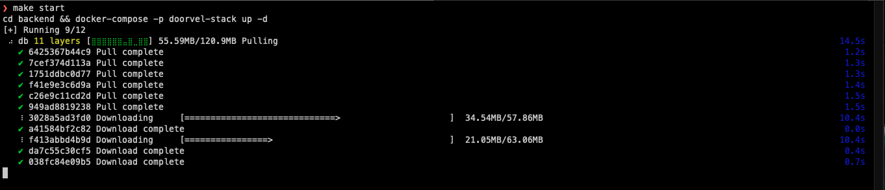
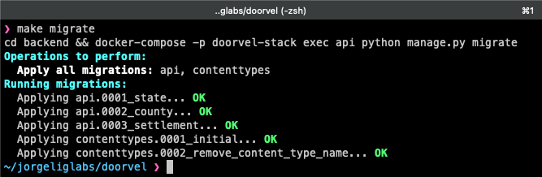
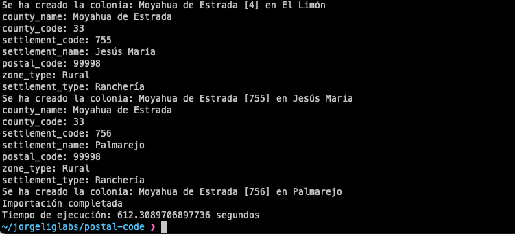
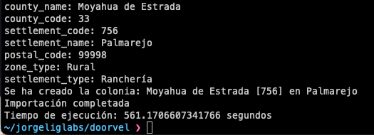
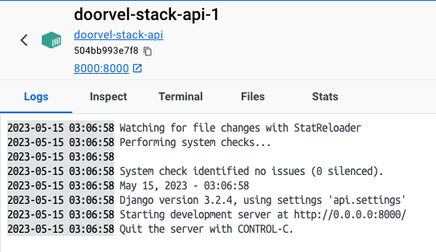
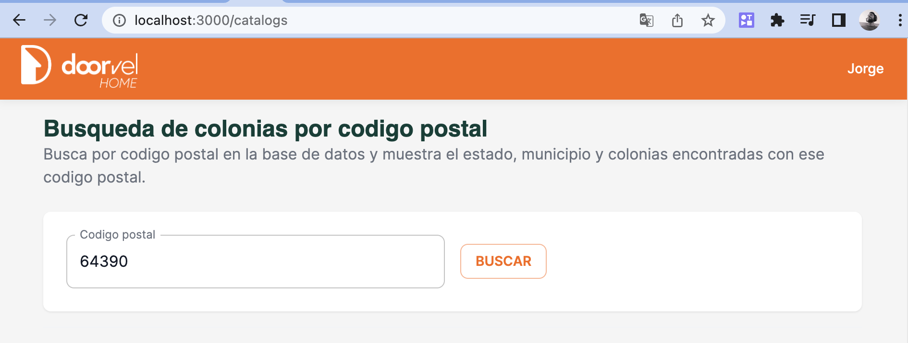
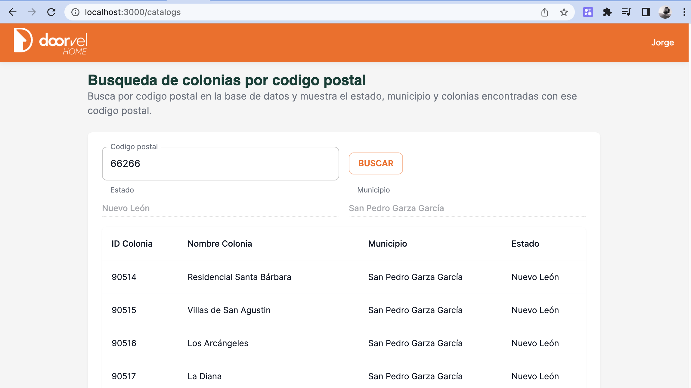
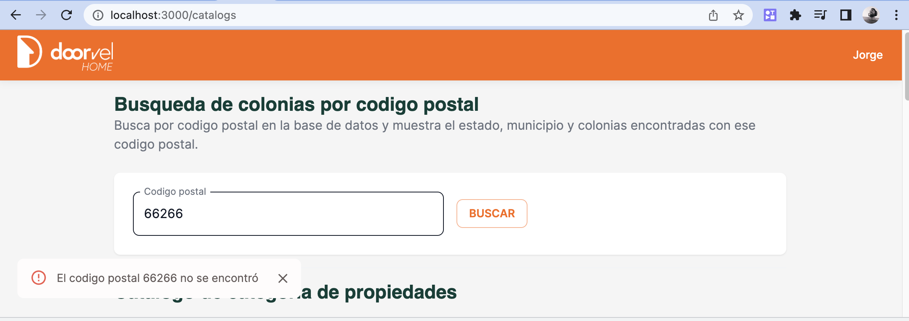
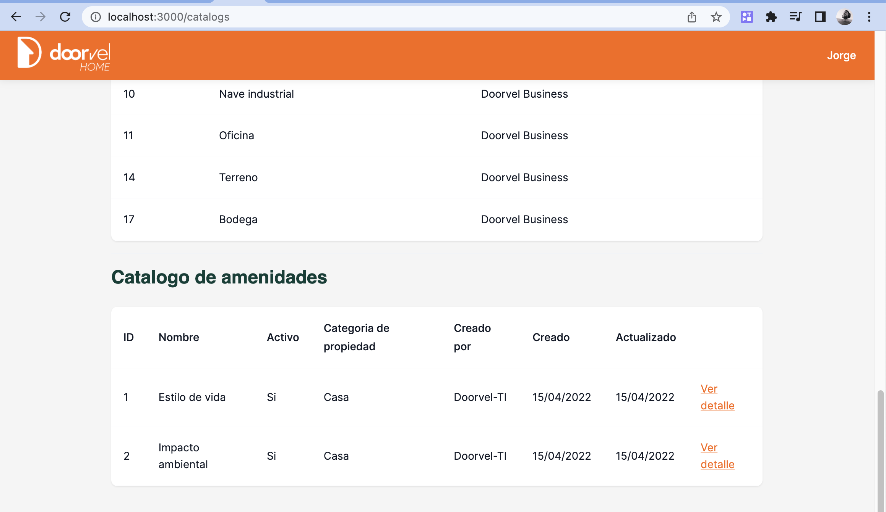
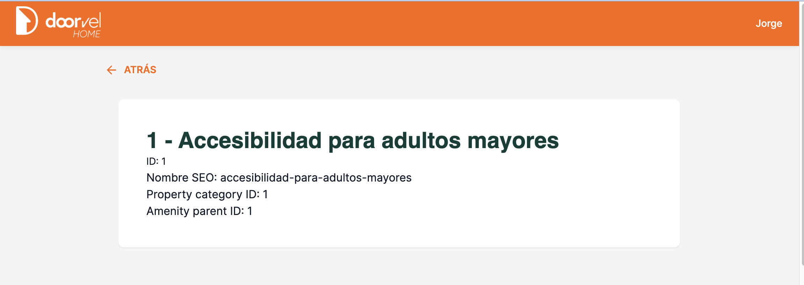

# Doorvel

Desafio para doorvel incluyendo backend con un api Django y front usando Next.js 13 y la biblioteca MUI

### Checklist

- [X] Desarrollo de interfaz en Next.js
- [X] Consumo de servicios de endpoints proporcionados
- [X] Uso de useContext para el manejo de estado
- [X] Utilización de componentes de Mui (https://mui.com/)
- [X] Implementación de rutas dinámicas y estáticas
- [X] Implementación de buenas prácticas de desarrollo
- [X] Evaluación de la arquitectura y estructura de archivos
- [X] Uso de estilos CSS o SCSS modules: Se implemento el theme de Mui para personalizar componentes con el branding de doorvel.
- [ X ] Evaluación de la calidad de código y uso de librerías/herramientas adicionales: Se implementaron Layouts, hooks y servicios para aislar lo mejor posible la logica de la aplicacion de la implementacion.
- [ X ] Evaluación de la experiencia de usuario (UX): Se cuido las descripciones y Snackbar para dar feedback al usuario
- [ Extra ] Docker: Se utilizó Docker para contenerizar tanto el proyecto backend como el proyecto frontend. Esto permite tener un entorno de desarrollo aislado y reproducible, facilitando la configuración y eliminando posibles conflictos de dependencias.
- [ Extra ] Makefile: Se incluyó un archivo Makefile en la raíz del proyecto para automatizar tareas comunes, como iniciar los contenedores, detenerlos, limpiar el entorno, realizar migraciones de base de datos, sembrar datos de prueba, etc. El uso de Makefile simplifica el proceso de desarrollo y reduce la necesidad de escribir comandos largos y complicados manualmente.
- [ Extra ] 
- [ Extra ] 
- [ Extra ] 

### Requerimientos

- Node.js
- Docker
- Docker Compose
- Python
- Django
- MySQL

## Configuración

1. Clonar este repositorio:

   ```bash
   git clone https://github.com/Jorgelig/doorvel
   cd doorvel
## Configuración de entorno desarrollo

1. Levanta los contenedores Docker y espera unos segundos para que los servicios se inicien correctamente:
   ```bash
   make start
  
2. Copia el archivo .env
   ```bash
   cp .env.example .even

## Uso en desarrollo
Para levantar el ambiente de desarrollo, ejecuta el siguiente comando en la raíz del proyecto: Esto levantará los contenedores de Docker y correrá la aplicación. Si todo está configurado correctamente, podrás acceder a la aplicación 

1. Realiza las migraciones en el proyecto Django:
   ```bash
   make migrate

2. Importa los datos de los codigos postales:
   ```bash
   make seed
   ```
3. Los servicios disponibles:
   - API: El servicio estará disponible en `http://localhost:8000`. 
      -- Puedes probar entrando a la url `http://localhost:8000/ping`
      -- Si todas las migraciones y seeds fueron cargados deberias poder buscar por codigo postal:
            --- `http://localhost:8000/zip-codes/66266/`
            --- `http://localhost:8000/zip-codes/64390/`
   - Front: La pagina de nextjs puedes verla en `http://localhost:3000/`

Para detener los contenedores, ejecuta:
   ```bash
   make stop
   ```
Si necesitas reiniciar los contenedores, puedes usar el comando:
   ```bash
   make restart
   ```
Si deseas eliminar todo lo relacionado con los contenedores, puedes usar:
   ```bash
   make clean
   ```
Esto eliminará los contenedores, imágenes, volúmenes y redes relacionados con el proyecto.

## Capturas
#### Make start

#### Back - Migracion en api


#### Back - Seed para poblar la BD


#### Back - Seed exitoso


#### Back - Api lista


#### Front - Login
Solo se captura el nombre del usuario para dejarlo visible en la barrade navegacion


#### Front - Busqueda de colonias por codigo postal usando el api de Django

#### Busqueda exitosa

#### No se encontro codigo postal

#### Listado de catalogos de amenidades y subamenidades

#### Detalle de subamenidad usando rutas dinamicas de nextjs



